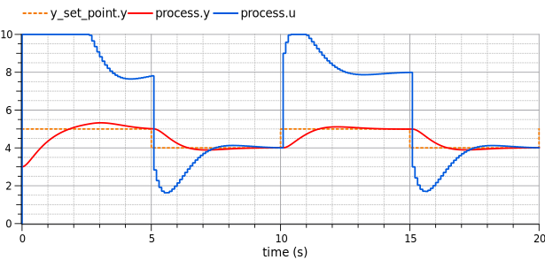

# Heating PI Control Demo

This example demonstrate the usage of NumRPC on a simple control example.

The simulation model, including the model of the physical process (heating system) is implemented in Modelica (in the `PIControlDemo` package).
The control is implemented as the RPC server, in Python.
In Modelica, the `ControlRemote` model sends the RPC requests
to this server.

To run this example:

1. launch the Python RPC server TO BE WRITTEN
2. load and simulate `DemoRemote` from the `PIControlDemo` package.

For comparison purpose, an equivalent demo (`DemoStandalone`) is implemented with a controller purely written in Modelica (`ControlStandAlone`). This stand alone demo doesn't need the RPC server.

